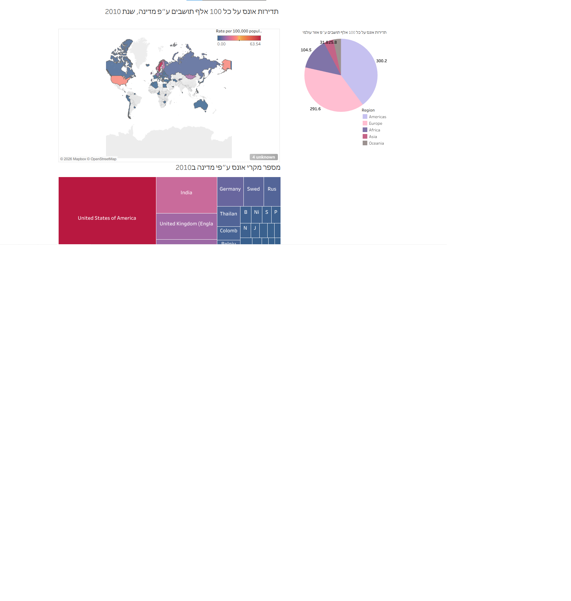

# Global_SA_Statistics_Dashboard
This project presents an exploratory data analysis of cases categorized as rapes* rate per 100,000 people for the year 2010. Using interactive visualizations and geographic mapping, the project highlights regional patterns, country-level differences, and comparative insights across continents.

